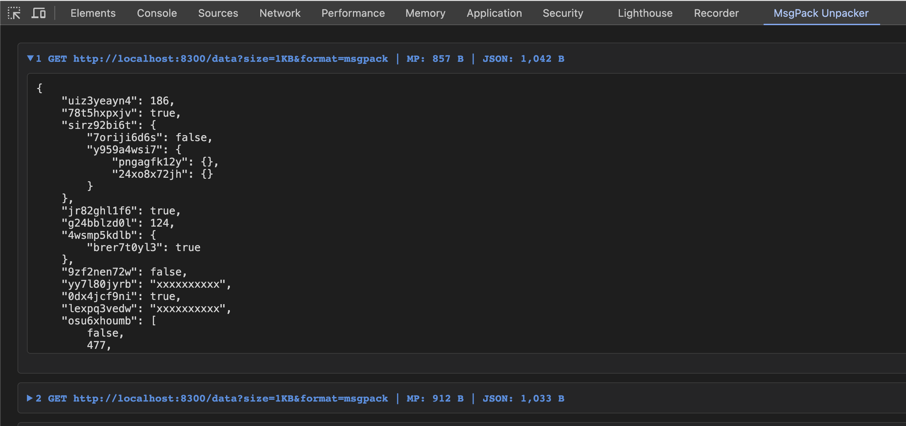

    
    <h1>MessagePack DevTools Unpacker</h1>
    

    

    <b>Unpacks MessagePack payloads into JSON inside DevTools.</b>
      
    

[MessagePack](https://msgpack.org/) is the incredible alternative for serializing data in network transmissions.
However, it has one significant drawback in compare with widely used and familiar JSON format -- it's readability by humans.

This extension makes an attempt to compensate this inconvenience by unpacking MessagePack-decoded payloads to the regular JSON, and displaying it into separate DevTools tab.
